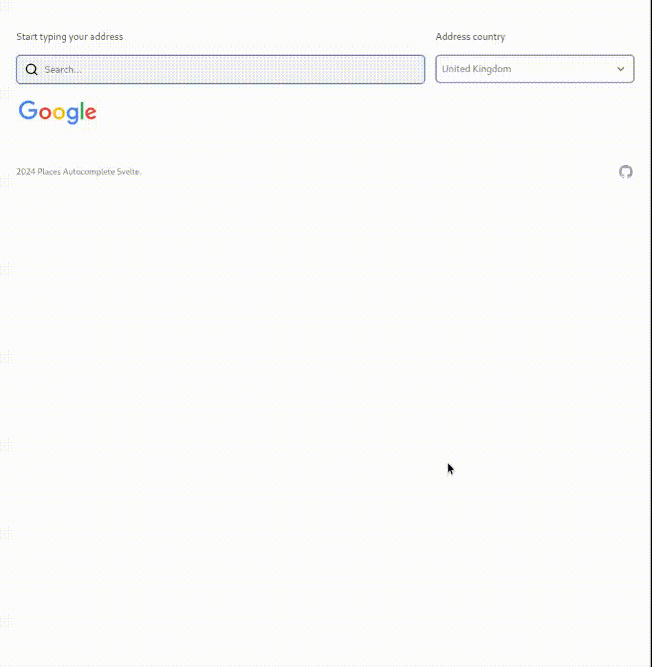

# Places Autocomplete Svelte

This Svelte component leverages the [Google Maps Places Autocomplete API](https://developers.google.com/maps/documentation/javascript/place-autocomplete-overview) to provide a user-friendly way to search for and retrieve detailed address information within your [SvelteKit](https://kit.svelte.dev) applications.

## Features:
- Seamless Integration: Easily integrate the component into your SvelteKit projects.
- Autocomplete Suggestions: Provide users with real-time suggestions as they type, enhancing the search experience.
- Detailed Address Retrieval: Retrieve comprehensive address information, including street address, city, region, postal code, and country.
- Formatted and Unformatted Responses: Access both formatted address strings and raw address component data for flexible use cases.
- Country Selection: Allow users to specify a region for more targeted results.





## Requirements

Before using this component, you'll need:
- Google Maps API Key: Create an API key with the Places API (New) enabled. Refer to [Use API Keys](https://developers.google.com/maps/documentation/javascript/get-api-key) for detailed instructions.


## Installation

Using npm:

```bash
$ npm i places-autocomplete-svelte
```


## Import Component

```javascript
import PlaceAutocomplete from 'places-autocomplete-svelte';
```

## Basic Usage

Initiate the component with your public Google Maps API key `PUBLIC_GOOGLE_MAPS_API_KEY` and `formattedAddress` properties. Enter your search query in the search box, then click to select the results. The `formattedAddress` property poulated with the place name and address. 

The request default `language: 'en-GB'` and `region: 'GB'`, see below to specify different.

Use keyboard `up` and `down` key to navigate the  suggested results. `esc` will clear the search query. 

```js
<script>
import  {PlaceAutocomplete}  from 'places-autocomplete-svelte';
    
//the business name and address.
let formattedAddress = '';
// Your Google Maps Public API Key
let PUBLIC_GOOGLE_MAPS_API_KEY = '--YOUR_API_KEY--';
</script>

<PlaceAutocomplete bind:PUBLIC_GOOGLE_MAPS_API_KEY bind:formattedAddress/>

// Etihad Stadium, Etihad Campus, Manchester M11 3FF
<p>{formattedAddress}</p>

```
- Replace `'--YOUR_API_KEY--'` with your actual Google Maps API key.
- The `formattedAddress` variable will be populated with the selected place's formatted address string.

## Accessing Address Components

```js
<script>
import  {PlaceAutocomplete}  from 'places-autocomplete-svelte';
// formatted address object    
let formattedAddressObj = {
    street_number: '',
    street: '',
    town: '',
    county: '',
    country_iso2: '',
    postcode: ''
};
// Your Google Maps Public API Key
let PUBLIC_GOOGLE_MAPS_API_KEY = '--YOUR_API_KEY--';

</script>

<PlaceAutocomplete 
    bind:PUBLIC_GOOGLE_MAPS_API_KEY 
    bind:formattedAddressObj />
/**
 * Formatted address
 * {
 *   "street_number":"Etihad Stadium",
 *   "street":"Etihad Campus",
 *   "town":"Manchester",
 *   "county":"Greater Manchester",
 *   "country_iso2":"GB",
 *   "postcode":"M11 3FF"
 * }
*/
<p>{JSON.stringify(formattedAddressObj)}</p>

```

- The `formattedAddressObj` will contain parsed address components, allowing you to access individual elements like street number, town, and postcode.

Address Parsing:

The Google Mps API `fetchFields()` method retrieves detailed place information. This information is then mapped to the `formattedAddressObj` based on address component types. The following mapping corresponds to the following  component types:

- `street_number`: longText property of the `street_number`
- `street`: longText property of the `route`
- `town`: longText property of the `postal_town`
- `county`: longText property of the `administrative_area_level_2`
- `country_iso2`: shortText property of the `country`
- `postcode`: longText property of the `postal_code`

Benefits:

By using `formattedAddressObj`, you can easily access individual address components like street number, town, and postcode, simplifying address manipulation in your application.

## Specifying Countries


```js
<script>
import  {PlaceAutocomplete}  from 'places-autocomplete-svelte';
    
//the business name and address.
let formattedAddress = '';
// Your Google Maps Public API Key
let PUBLIC_GOOGLE_MAPS_API_KEY = '--YOUR_API_KEY--';
// countries
let countries = [
    { name: 'United Kingdom', region: 'GB' },
    { name: 'United States', region: 'US' },
    { name: 'Switzerland', region: 'CH' },
    { name: 'Greece', region: 'GR' },
    { name: 'Russia', region: 'RU' },
    { name: 'Japan', region: 'JP' }
];
</script>

<PlaceAutocomplete 
    bind:PUBLIC_GOOGLE_MAPS_API_KEY 
    bind:formattedAddress 
    bind:countries/>

// Etihad Stadium, Etihad Campus, Manchester M11 3FF
<p>{formattedAddress}</p>

```

- The `countries` array allows users to select a specific region for their search.

An optional property `countries` to allow country selection. As per [Google Maps documentation](https://developers.google.com/maps/documentation/javascript/reference/autocomplete-data#AutocompleteRequest):

`The region code, specified as a CLDR two-character region code. This affects address formatting, result ranking, and may influence what results are returned. This does not restrict results to the specified region.`


## Formatted and Unformatted reponses

```js
<script>
import  {PlaceAutocomplete}  from 'places-autocomplete-svelte';
    
//the business name and address.
let formattedAddress = '';
// full unformatted response
let fullResponse = [];
// Your Google Maps Public API Key
let PUBLIC_GOOGLE_MAPS_API_KEY = '--YOUR_API_KEY--';
// countries
let countries = [
    { name: 'United Kingdom', region: 'GB' },
    { name: 'United States', region: 'US' },
    { name: 'Switzerland', region: 'CH' },
    { name: 'Greece', region: 'GR' },
    { name: 'Russia', region: 'RU' },
    { name: 'Japan', region: 'JP' }
];
</script>

<PlaceAutocomplete 
    bind:formattedAddress
    bind:formattedAddressObj
    bind:fullResponse
    bind:PUBLIC_GOOGLE_MAPS_API_KEY
    bind:countries/>

```
Depending on your application requirements you can bind the component properties as needed.
Below example binds all three responsones:
- `formattedAddress` - place name and address as string
- `formattedAddressObj` - populated with the parsed address components
- `fullResponse` - populated address components response as it retruned from `fetchFilds()` method

## Customization:

- **Language:** The component defaults to `language: 'en-GB'` and `region: 'GB'`. You can customize these settings as needed.


## License

[MIT](LICENSE)

